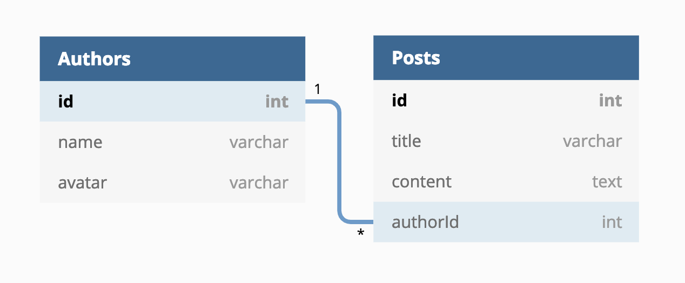

# GraphQL Server with Apollo

> Simple GraphQL server with Apollo supporting Query and Mutation

## Database Models

Database relationship: `one-to-many`

Thanks [dbdiagram](https://dbdiagram.io/) for online tool create database models and relationships

## Guide

1. Install dependencies: `yarn install`
2. Migration DB: `yarn db:migration`
3. Seed data: `yarn db:seed`
4. Start server: `yarn server`

Enjoy!
